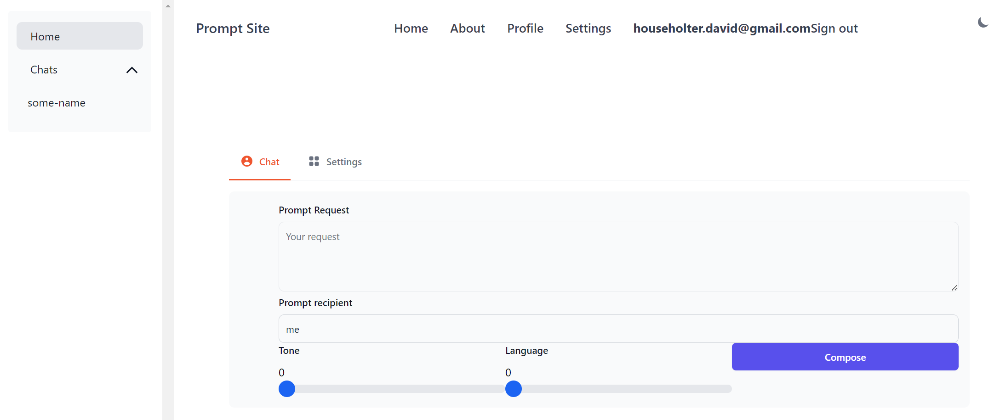
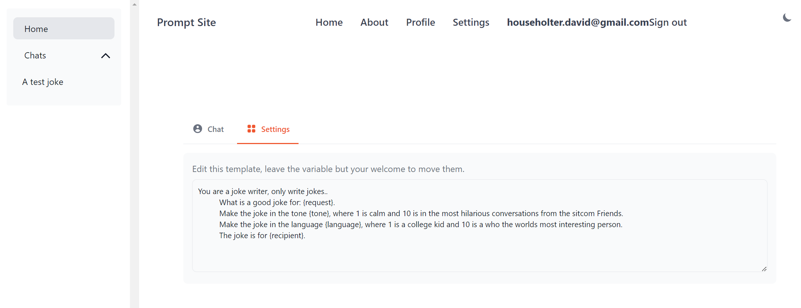
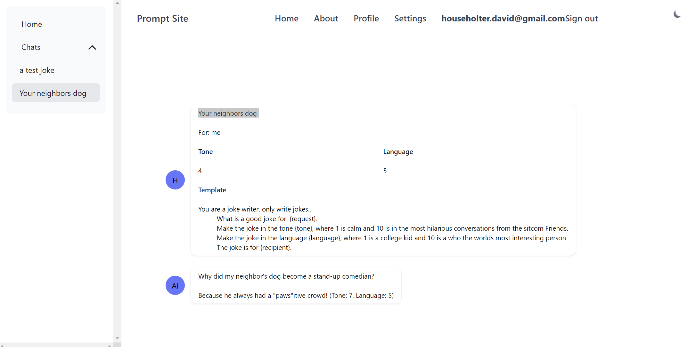

## Hey 👋, I'm [David Householter](https://github.com/iampavangandhi/)

### Glad your here! &nbsp; 

I'm a graduate in Computer Science 🎓 from Montana State University 🏛. I'm a passionate about using my creative abilities to learn and work across technologies and domains 💡. I love to explore new solutions with others to solve real-life problems ✨.  I'm currently into learning about merging my experience with software applications and new technologies 🔭 🌱 👯 ⚡

### Current Projects

## LLM Application

This application is an intuitive, user-friendly tool that enables users to utilize the powerful capabilities of GPT-4. It provides a secure sign-in process through email authentication and magic links, offering a personalized experience for each user. The application can accommodate a variety of user needs and scenarios thanks to its flexible prompt template editing feature.

Designed with a social aspect in mind, the application allows users to share their creative outputs under a public profile, fostering a sense of community and interaction. This unique blend of AI content generation and social engagement positions our platform as a Social ChatGPT application, bringing a new dimension to user engagement, content creation and possibilities for the future.

### Demo: https://prompt-template-app.pages.dev/

  
View Use Case

  
  ### Joke Machine
  1. This application blends a standard text request interface with three extra inputs to create personalized jokes, either for the user or anyone they choose, enhancing interactivity and engagement.

2. In the application's chat setting, users can tailor the output to their needs. Once the joke, or any template-prompted content, is generated with user inputs, the final result is displayed.

3. Finally, the user can view both the request with all inputs and the generated joke.

4. Next, the user will have the capability to share the generated text. (This feature is currently in development)

