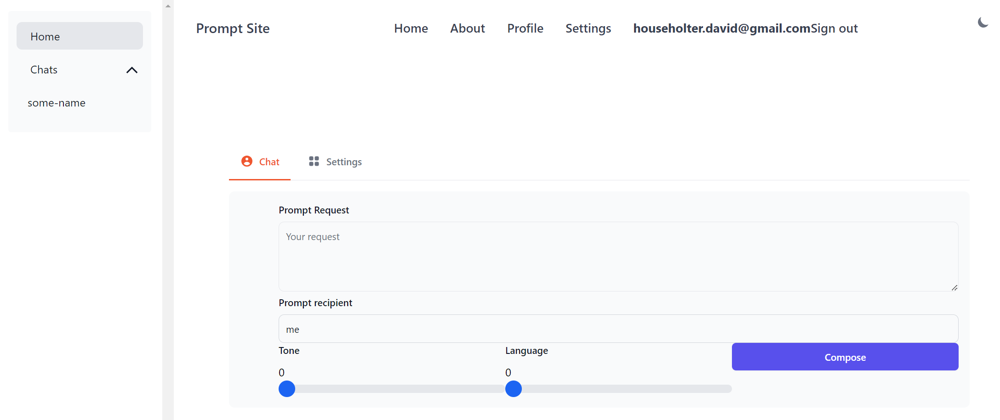
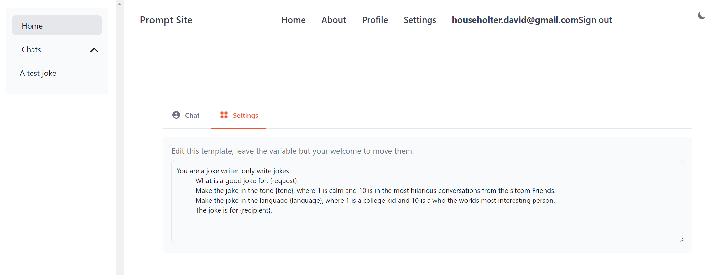

## Hey 👋, I'm [David Householter](https://github.com/davidhouseholter)

### Product-Driven Lead Software Engineer & Entrepreneur

I am a specialist in translating complex business challenges into scalable technical solutions. With over **10 years of experience** bridging the gap between technical and non-technical stakeholders, I have architected high-impact solutions across **AI/LLMs, Cloud Infrastructure, and Web3**.

Currently, I am building the next generation of AI tooling.

---

### 🛠 Tech Stack & Architecture

**Core Languages**

**Infrastructure & DevOps**

**Web & Frameworks**

---

### 🚀 Featured Project: Fiberwise AI

**Creator & Lead Developer**

Fiberwise is the central management hub for a unified AI ecosystem. It provides a single interface for applications, data, and AI agents.

*   **Agent Management:** Deploy, manage, and monitor AI agents with real-time debugging and full execution history.
*   **Dynamic Data:** Automatically generates backend infrastructure (DBs & APIs) directly from simple YAML definitions.
*   **SDKs:** Custom Node.js and Python SDKs for programmatic interaction with the platform.

[**📂 View Organization & Code**](https://github.com/Fiberwise-AI/)

  
<b>📸 View Screenshots (Prompt Social App)</b>

   
  
  *The Fiberwise ecosystem includes user-facing applications for interacting with LLMs.*
  
  **1. Input Interface:** Blends standard text requests with custom inputs.
  <!-- Ensure these image paths are correct in your repo, or update them to the full URL -->
  

  **2. Customization:** Users tailor the output in a chat setting.
  

---

### 💼 Professional Experience

*   **Fiberwise AI** - Creator & Lead Developer *(Current)*
*   **Snorkle AI** - AI Task Engineer (Contract)
    *   *Delivered 20+ engineering benchmarks, optimized ML inference gateways (3x speedup), and deployed microservices on Kubernetes.*
*   **TackleAI** - Sr. Software Engineer
    *   *Engineered LLM-driven data extraction services (90% accuracy) and led SaaS portal development.*
*   **IncOperate** - Lead Software Engineer & Startup CTO
    *   *Led end-to-end product lifecycle for a patented customer engagement platform and Web3 integration.*

---

  
  

