# David Householter

Lead Software Engineer. Creator of [Fiberwise AI](https://github.com/Fiberwise-AI), [MatterWave AI](https://github.com/MatterWave-AI), [MatterCraft](https://mattercraft.tech) and [David Householter Earth](https://davidhouseholter.earth).

<table>
<tr>
<td align="center" width="20%">
<h3>Platform</h3>

AI agent platform development. OIDC/RBAC security, row-level and org/app multi-tenant isolation, real-time streaming updates, plug-and-play worker backends

</td>
<td align="center" width="20%">
<h3>Tool</h3>

Installable package libraries and CLIs for authoring AI agents, graph-based execution pipelines, AI-powered applications, and data layers

</td>
<td align="center" width="20%">
<h3>Research</h3>

Novel architectures, knowledge representations, and dataset design

</td>
<td align="center" width="20%">
<h3>Agent</h3>

Agents run autonomously within scoped permissions (JWT claims control CWD, tools, modes). Dispatched, orchestrated, and coordinated across machines via the A2A protocol

</td>
<td align="center" width="20%">
<h3>ML Pipeline</h3>

Data generation, fine-tuning (SFT, RL, adapters), and benchmark evaluation - the full path from synthetic training data to trained model to published results

</td>
</tr>
</table>

## Fiberwise AI

Build, deploy, and manage AI agents from a single platform. Define agents and data models in a YAML manifest, deploy them as versioned app bundles, and monitor activations in real time through a WebSocket-driven dashboard. A bundle is a self-contained app package: the manifest, Python agents, JS components, pipeline definitions, and data model schemas - deployed in one command and version-tracked.

The platform enforces multi-tenant scoping on every API call - every query filters by organization_id and app_id, and each agent subprocess runs sandboxed in its own app bundle directory. The ActivationProcessor dispatches four agent types: LLM (config-only), Python class, graph pipeline, and A2A (remote CLI agents via JSON-RPC).

A2A agents (Claude Code, OpenCode, or any JSON-RPC CLI) stream NDJSON back to the platform, where results are stored and broadcast over WebSocket. The full flow: define in manifest, deploy as bundle, activate via API - config flows from YAML to DB to runtime without the A2A server ever storing state.

Pluggable OIDC auth (Keycloak, Auth0, Cognito, or a built-in provider for local dev) with full RBAC and permissions management. Apps can be deployed, installed, and shared across organizations.
An app is a YAML manifest, Python agents, JS components, pipeline definitions, and data model schemas - packaged as a versioned bundle and deployed in one command.

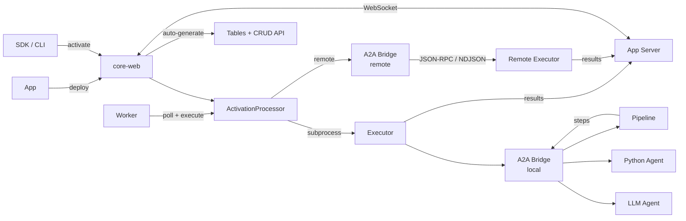
```mermaid
graph LR
    App["App"] -->|deploy| Platform["core-web"]

    SDK["SDK / CLI"] -->|activate| Platform
    Platform --> AP["ActivationProcessor"]

    AP -->|subprocess| Executor["Executor"]
    Executor --> LocalBridge["A2A Bridge\nlocal"]
    LocalBridge --> LLM["LLM Agent"]
    LocalBridge --> PyAgent["Python Agent"]
    LocalBridge --> Pipeline["Pipeline"]
    Pipeline -->|steps| LocalBridge

    AP -->|remote| RemoteBridge["A2A Bridge\nremote"]
    RemoteBridge -->|JSON-RPC / NDJSON| RemoteExec["Remote Executor"]

    Executor -->|results| Server["App Server"]
    RemoteExec -->|results| Server

    Platform -->|auto-generate| DataLayer["Tables + CRUD API"]
    Platform <-->|WebSocket| Server

    Worker["Worker"] -->|poll + execute| AP
```

## core-web `Platform` `Agent`

- Activate agents four ways from the same platform: config-only LLM agents (no code), Python class agents, graph pipelines, and A2A delegation to external CLI agents - the platform dispatches all four through a single activation path.
- Every activation runs with its own isolated service context - LLM provider, database, OAuth tokens, and SDK are injected automatically. The platform records cost, duration, and metrics per activation with NDJSON logging.
- A2A bridge translates JSON-RPC into NDJSON streams over WebSocket - Fiberwise agents delegate to external A2A agents (Claude Code, OpenCode, or any JSON-RPC CLI) and stream results back in real time.
- Define data models in your manifest and the platform creates database tables and CRUD API endpoints automatically. Supports per-user data isolation (disabled, enabled, or mixed mode).
- Run agent workers on Local, Celery, RabbitMQ, SQS, Redis, or External (webhook) backends. External machines connect and poll for queued activations - distribute agent work across infrastructure without changing agent code.
- Pluggable execution engine registry - register custom engines to control how activations are executed. The built-in engine runs ia_modules graph pipelines. Custom engines can forward activations to external systems for remote execution, or swap the underlying runtime entirely. More engine types planned.

<table>
<tr>
<td align="center" width="25%">

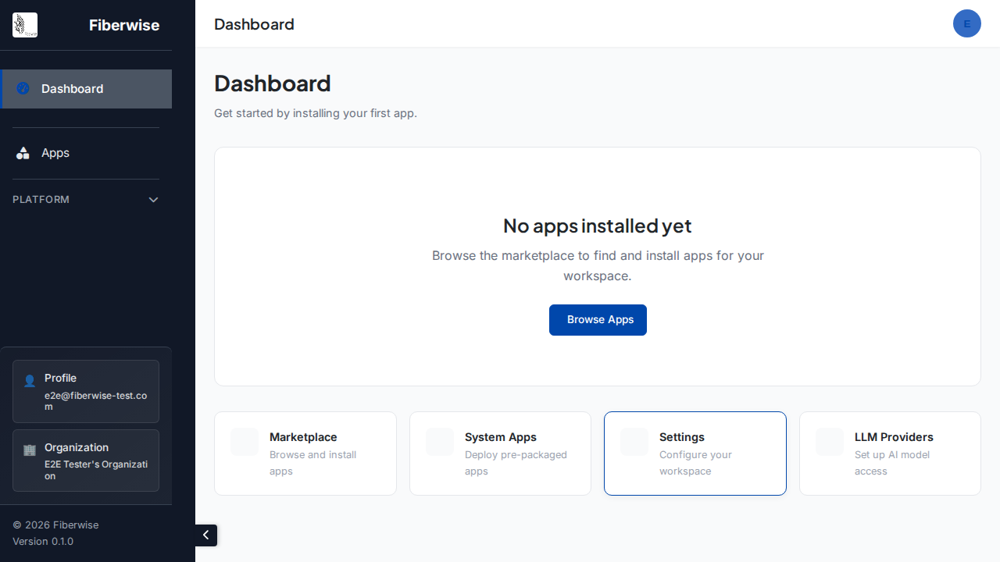 Dashboard

</td>
<td align="center" width="25%">

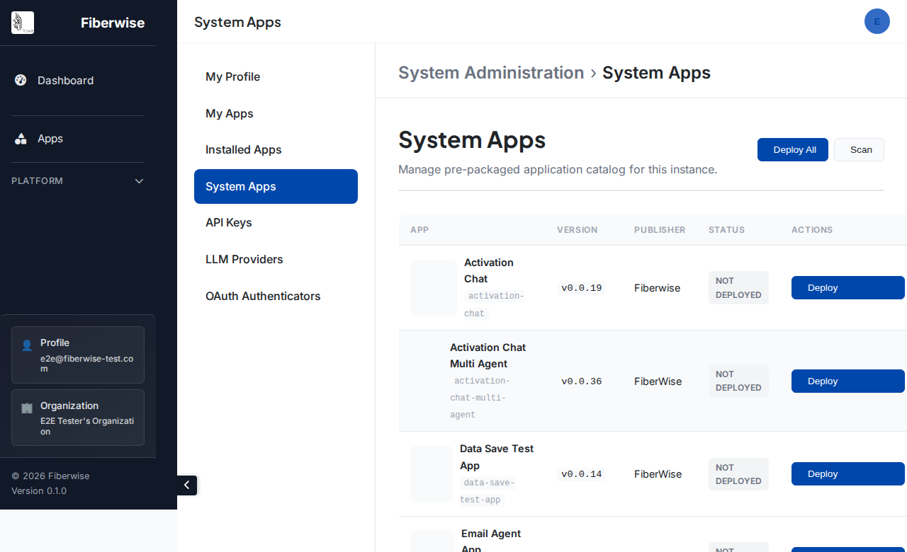 System Apps

</td>
<td align="center" width="25%">

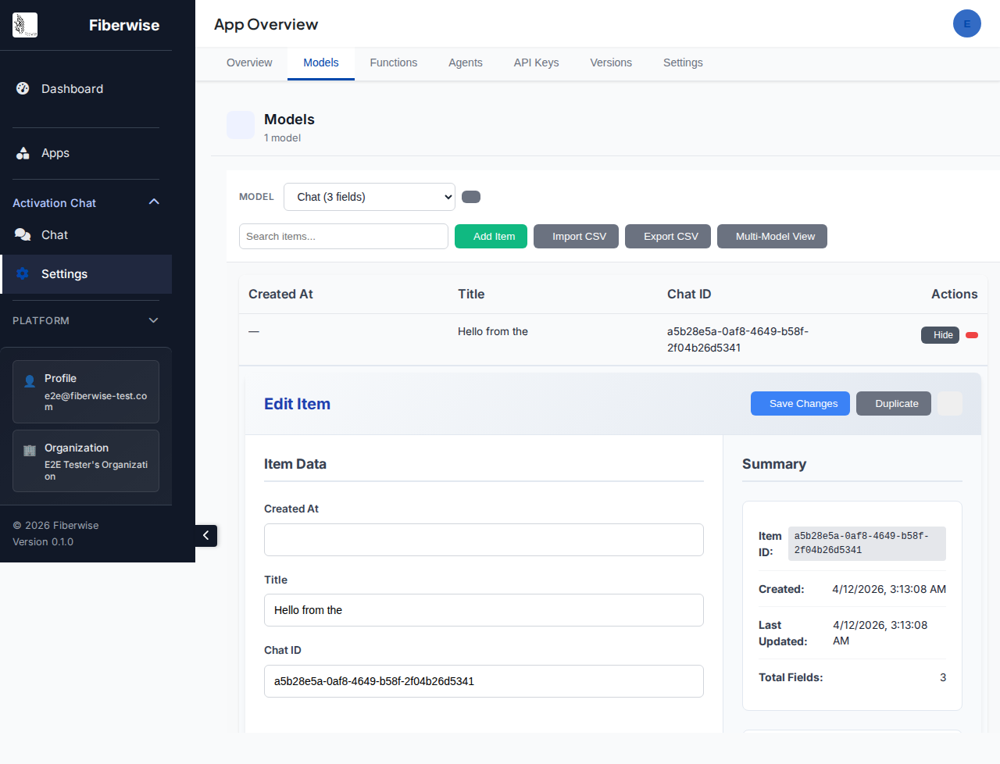 Models

</td>
<td align="center" width="25%">

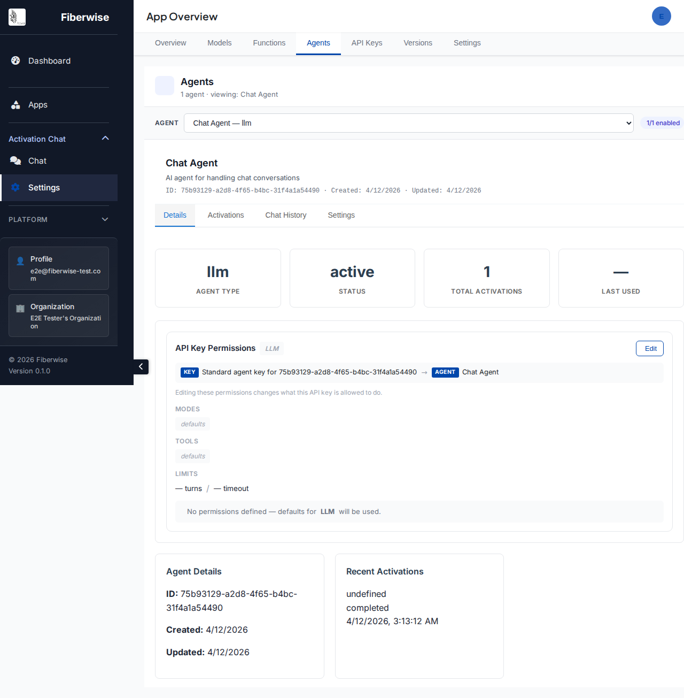 Permissions

</td>
</tr>
</table>

## common `Tool` `Agent`

Shared library that every Fiberwise component depends on. Provides the agent base class, service registry, and database abstraction.

- Write an agent as a Python class, a plain function, or just an LLM config (no code) - the platform runs all three the same way. Every agent gets automatic access to LLM providers, database, OAuth tokens, and the Fiberwise SDK.
- Validate agent inputs and outputs with JSON schemas defined in the manifest - bad data gets rejected before your agent runs.
- Every agent has access to a full service layer: user management, API keys, OAuth tokens, app versioning, LLM providers (OpenAI, Anthropic, Google AI, Ollama), pipelines, workflows, telemetry, email, scheduling (cron), decision audit trails, resumable checkpoints, circuit breakers, and file storage.
- Database abstraction via NexusQL - write queries in PostgreSQL syntax and they run on SQLite, MySQL, or MSSQL without changes. The platform handles dialect translation.
- Install agents, pipelines, workflows, and functions from a single manifest - the platform detects what each entity is, validates it, and registers it.

## CLI `Tool`

Command-line tool for building, deploying, and running Fiberwise apps locally or against remote instances.

- Point the CLI at any Python file and it detects whether it's an agent or a pipeline, then runs it. Optionally stream the activation in real time.
- Run multiple functions in four modes: sequential, parallel, piped output-to-input (chain), or as a multi-turn agent conversation.
- Switch between local and remote with a flag - `local` talks directly to SQLite with zero network overhead, or target any saved remote instance by name.
- One command starts the full local dev stack: API server, frontend dev server, background worker, and file watcher that picks up Python changes automatically.
- Deploy, update, or delete apps with automatic version bumping (major/minor/patch). Deleting an app preserves data unless you explicitly remove it.
- Manage the same app across multiple Fiberwise instances - each instance tracks its own app ID, version, and last operation independently.
- Start a background worker that processes queued agent activations, with configurable concurrency and timeout.
- OAuth providers declared in your manifest are auto-detected and registered on deploy.

## SDK (Node.js) `Tool`

Client library for building browser and server-side apps on the Fiberwise platform.

- Stream agent responses in real time via SSE - get partial results as the agent works, with callbacks for each message, completion, and errors. Cancel anytime.
- Works in the browser and Node.js without code changes - auto-detects the environment.
- Built-in app router that handles navigation within Fiberwise apps - distinguishes root-level and per-user installations and prefixes routes correctly.
- WebSocket connection with automatic reconnection and message queueing - if the connection drops, messages buffer and send when it recovers.
- Query activation history with filters (status, agent, context) and pagination.

## SDK (Python) `Tool`

Client library for Python apps and scripts that interact with the Fiberwise platform.

- Stream agent responses as an async iterator - results arrive as they're produced, with built-in message buffering.
- Works in both async and sync Python - the SDK tries async first and falls back to sync automatically.
- Same SDK calls talk to a local database or a remote API - switch between local dev and production without changing code.
- Built-in email abstraction - read, filter, and process emails from any provider through a single interface. Supports text, HTML, attachments, labels, and threading.
- File storage abstraction - upload, download, list, and extract archives through one API, local or cloud.
- Configure LLM providers at runtime - add OpenAI, Anthropic, Google, local models, or mocks, set defaults, and switch between them without redeploying.
- Package and deploy AI models as Fiberwise apps - wrap an LLM, embedding model, or image model into a versioned manifest and deploy it.

## fiber-apps `Platform`

Reference apps that ship with the platform, demonstrating how to build on Fiberwise.

- Chat apps store every message as an agent activation - conversation history is queried through the same activation API, filtered by context, with full audit trails.
- Multi-agent conversations where several agents respond in the same chat. Users can edit or retry any message, and parent message tracking allows conversations to branch.
- Email agent that connects to Gmail, Outlook, or Yahoo via OAuth. Reads your inbox, runs AI analysis (sentiment, priority, topics, action items), caches locally, and supports custom prompt templates per user.
- Pipelines that trigger on events (e.g., an agent finishes) with filters to prevent loops. Each step retries, times out, or fails independently. Manual triggers with role-based access and typed input forms.
- Each app is fully declared in one manifest: page routes with dynamic parameters, data models with typed fields, agents with permissions (OAuth, data read/write, LLM access), serverless functions with schemas, and OAuth configs with scopes.

---

## MatterWave AI

Foundation model research lab - building models, agents, tools, and datasets that advance the frontier of AI.

### ia_modules `Tool` `Agent`

Python framework for building AI agent pipelines with graph-based execution and multi-agent coordination.

- Define pipelines as directed graphs with 6 step types: LLM, Function, Agent, A2A, Parallel, and Orchestrator. The engine resolves execution order topologically and auto-parallelizes independent steps.
- Zero-trust agent permissions - JWT claims control what an agent can access (CWD, tools, modes). The enforce_agent_claims() gate rejects any activation that doesn't meet its declared permissions.
- Orchestrator step type coordinates multiple agents within a single pipeline - routes inputs, collects outputs, and controls turn order. Used to build patterns like consensus, debate, hierarchical delegation, and peer-to-peer negotiation.
- Conditional routing between pipeline steps - branch execution based on previous step outputs. Checkpointing lets you resume a pipeline from any step without re-running earlier work.
- Template resolution across pipeline steps - outputs from earlier steps are injected into later step configs automatically, so pipelines compose without manual wiring.
- Pluggable identity provider adapters - connect to Keycloak, Auth0, or Cognito for agent auth without changing pipeline code.

<table>
<tr>
<td align="center" width="25%">

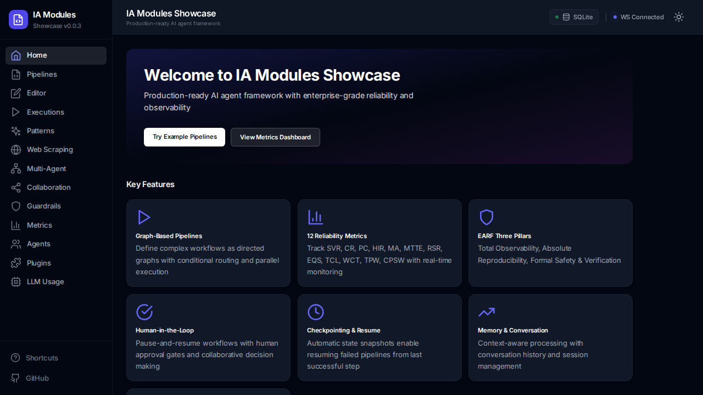 Home

</td>
<td align="center" width="25%">

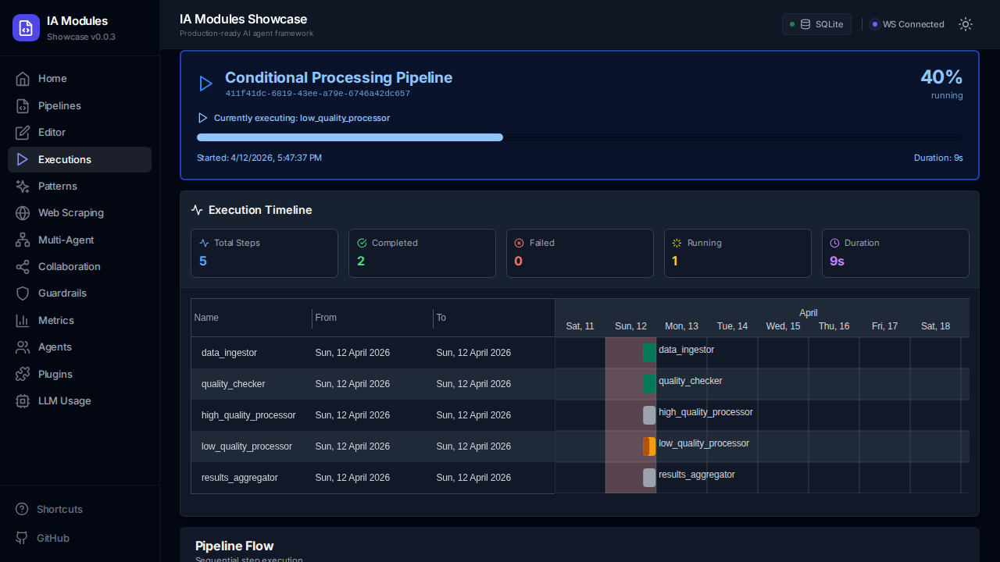 Executions

</td>
<td align="center" width="25%">

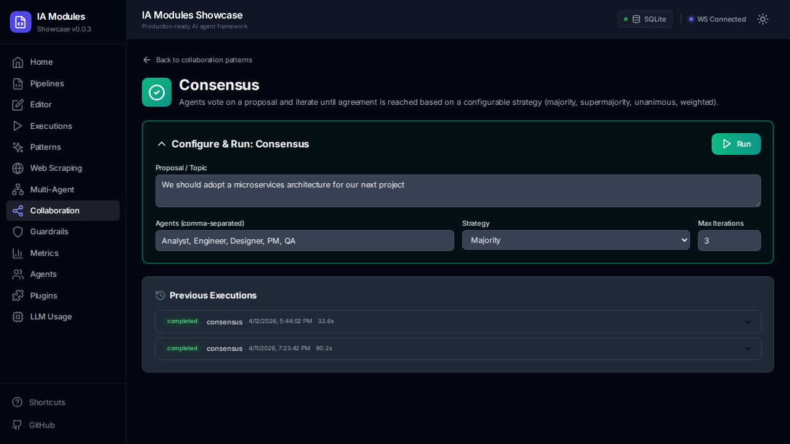 Consensus

</td>
<td align="center" width="25%">

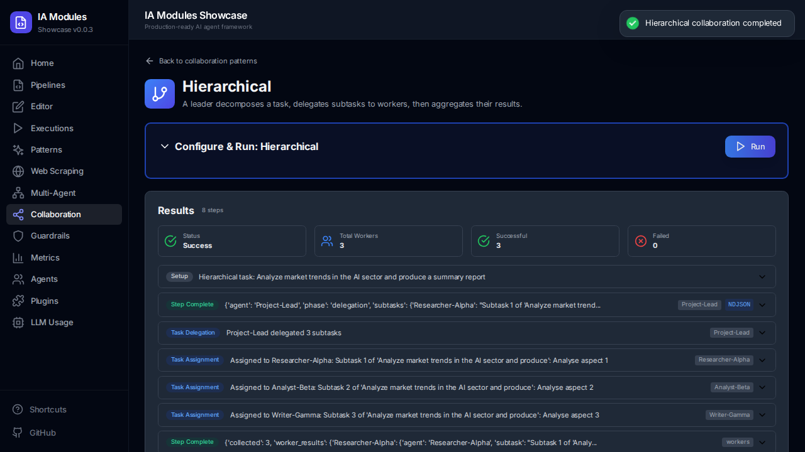 Hierarchical

</td>
</tr>
</table>

### nexusql `Tool`

Universal data access layer - write SQL once and run it on SQLite, PostgreSQL, MySQL, or MSSQL.

- Auto-translates PostgreSQL DDL to other dialects: SERIAL, BOOLEAN, JSONB, NOW(), LIMIT/OFFSET, and other Postgres-specific syntax is rewritten per target database.
- Parameter syntax (:param_name) is auto-translated per dialect - write one parameterized query and it works across all four databases.
- Migration runner that tracks schema versions - write migrations in PostgreSQL and they apply correctly on any supported database.

### SDD `Research` `ML Pipeline`

Synthetic Document Dataset - end-to-end pipeline from template-based document generation through fine-tuning to public benchmark evaluation.

- Generate synthetic documents from Jinja2+RDFa templates with Faker data, rendered through Paged.js and extracted via PyMuPDF - each document includes pixel-perfect NER bounding boxes for every entity.
- 14 entity types across 275+ templates, with annotations in three formats: JSON, JSON-LD, and Turtle (RDF). Every annotation maps directly to bounding box coordinates in the rendered PDF.
- Fine-tuning pipeline supporting 8 VLM configs - SFT and GRPO reinforcement learning with QLoRA adapters. Code complete, waiting on GPU.
- Four benchmark tracks evaluating OCR and NER accuracy across models. Bootstrap significance tests for statistical rigor. Public benchmark dashboard for reproducible results.

<table>
<tr>
<td align="center" width="25%">

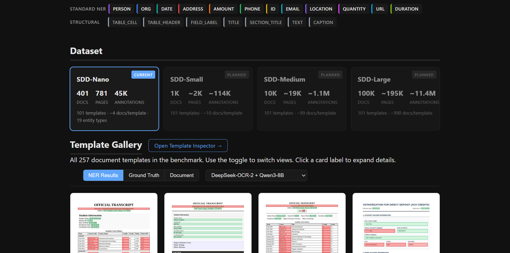 Dataset

</td>
<td align="center" width="25%">

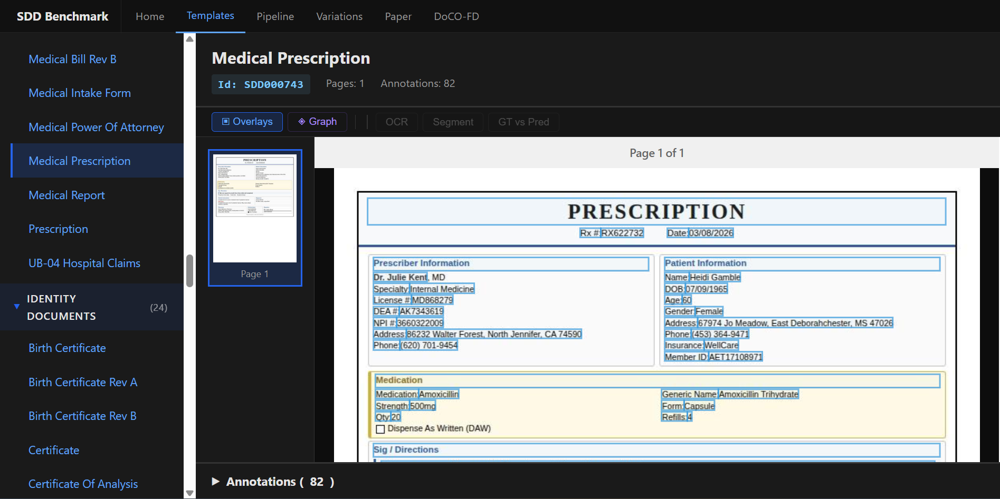 Template

</td>
<td align="center" width="25%">

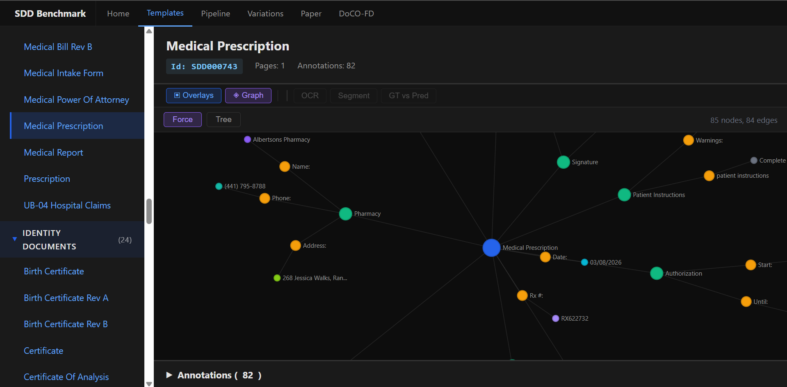 Knowledge Graph

</td>
<td align="center" width="25%">

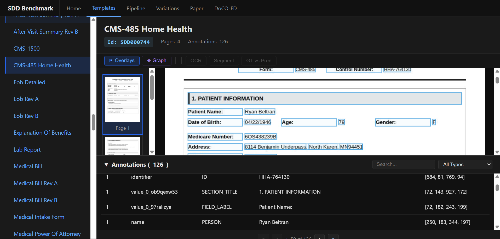 Annotations

</td>
</tr>
</table>

### GRT `Research`

Geometric Rotation Transformer - a novel transformer architecture where all weights are learned Givens rotations on SO(n), replacing standard linear layers entirely.

- Every weight matrix is composed of learned Givens rotations - the network operates entirely in rotation space (SO(n)) rather than using unconstrained linear transformations.
- Butterfly-shuffled rotation stages with content-dependent angle modulation via Clifford/Stokes coupling - the rotation angles adapt based on the input, not just learned static values.
- Mixture of Rotations FFN replaces the standard MLP feedforward - multiple rotation paths are combined instead of using dense matrix multiplications.
- Custom CUDA kernels for the rotation operations.

---

## MatterCraft `Platform` `Tool` `Research` `Agent` `ML Pipeline`

AI consulting - translates MatterWave research into phased AI implementations for businesses. Business intelligence, workflow automation, and custom AI development.

---

